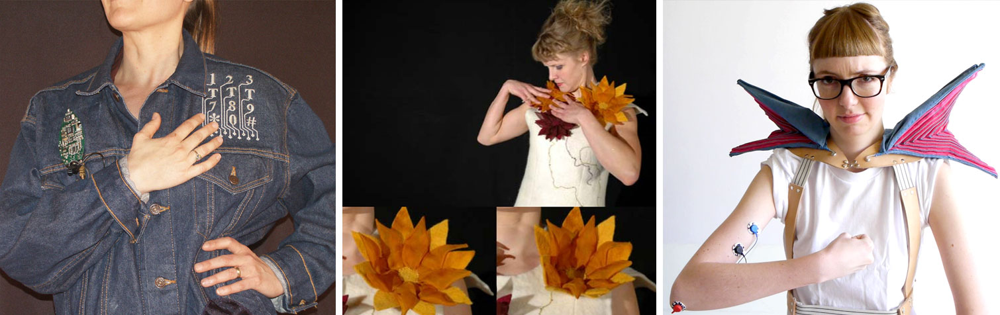
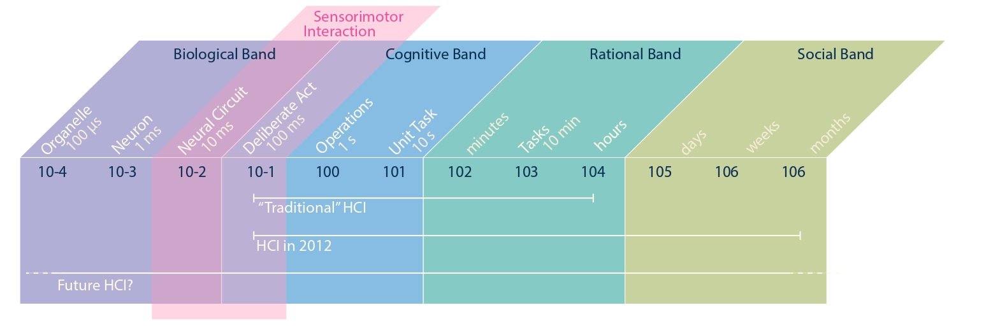
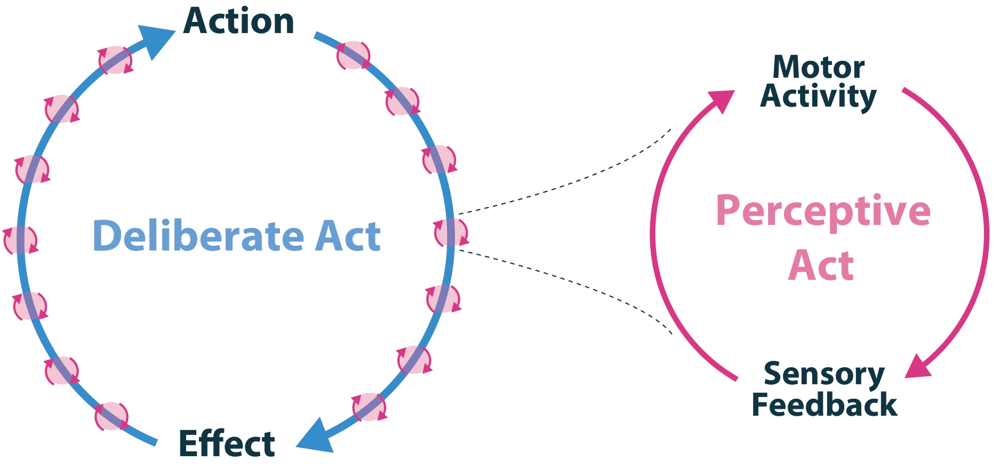
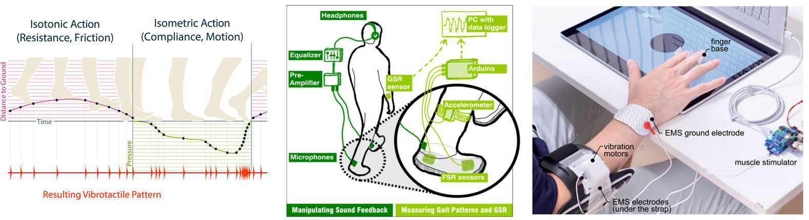

An emerging space in interface research is wearable devices that closely couple their sensing and actuation abilities. A well-known example is [MetaLimbs](https://dl.acm.org/doi/10.1145/3084822.3084837), where sensed movements of the foot are directly mapped to the actuation of supernumerary robotic limbs. These systems are different from wearables focused on sensing, such as fitness trackers, or wearables focused on actuation, such as VR headsets. They are characterized by tight coupling between the user's action and the resulting digital feedback from the device, in time, space, and mode. The properties of this coupling are critical for the user's experience, including the user's sense of agency, body ownership, and experience of the surrounding world. Understanding such systems is an open challenge, which requires knowledge not only of computer science and HCI, but also Psychology, Physiology, Design, Engineering, Cognitive Neuroscience, and Control Theory. This workshop aims to foster discussion between these diverse disciplines and to identify links and synergies in their work, ultimately developing a common understanding of future research directions for systems that intrinsically couple sensing and action.

*Early wearables, such as those designed by [Orth et al.](https://doi.org/10.1145/286498.286800) had a clear focus on sensing, or input (left). This was followed by a wave of explorations, exemplified here by work by [Berzowska et al.](https://doi.org/10.1145/1400385.1400447) focusing on actuation or output (middle). A newer design direction focuses on systems in which input and output are coupled. For example, [Hartman et al.'s Monarch](https://doi.org/10.1145/3357236.3395573) couples movement captured by EMG sensors to actuate a pair of wearable wings as a source of emotional expression (right). Here, sensing and actuation are coupled, providing output feedback based on both voluntary and involuntary gesture in social settings.*

# 1. Background
Wearable technology is maturing at an accelerated pace due to technological advances such as further miniaturization of electrical components and developments of soft electrically functional materials. With less effort required for understanding *how* to build wearable technologies, we are witnessing a shift towards exploring *what* opportunities arise from having technology so conveniently close to the body.

Currently, most wearables focus on a specific functions. They can be roughly be classified as either sensing devices, such as fitness trackers which sample information *from* the user, or as actuation or display devices, such as a wristwatch or other wearable displays, which provide information *to* the user. Many devices, such as smartwatches, combine sensing and actuating mechanisms. However, even in these devices, the actuation and sensing modalities are decoupled in time (e.g., there is a delay between input and output), location (e.g., input and output are not co-located), or mode (e.g., touch input vs. visual output). 

In contrast, an emerging research direction is the design of wearable systems in which *sensing and actuation are closely coupled*. In other words, sensing and actuation are synchronous, co-located, of the same mode, and with a temporal behavior enabling integration with the user's sensory and motor abilities. A striking example is [MetaLimbs](https://dl.acm.org/doi/10.1145/3084822.3084837), a wearable system that provides users with an additional pair of arms. Here, the user's foot movement is sensed in real-time and directly mapped to the movements of the robotic arm. Sensing and actuation are coupled and cannot be separated without removing the function of the system. Such systems have been used to provide augmented haptic realities (see [bARefoot](https://dl.acm.org/doi/10.1145/3379337.3415828), [vARitouch](https://dl.acm.org/doi/10.1145/3613904.3642828), and [From Pulse Trains to "Coloring with Vibrations"](https://dl.acm.org/doi/10.1145/3173574.3173639)), change our perception of our bodies (see [As Light as You Aspire to Be](https://dl.acm.org/doi/10.1145/3290605.3300888), [Action sounds update the mental representation of arm dimension](https://www.frontiersin.org/journals/psychology/articles/10.3389/fpsyg.2015.00689/full), [Soniband](https://dl.acm.org/doi/10.1145/3411764.3445558), [Body Transformation](https://dl.acm.org/doi/10.1145/3623509.3633373), and [Motionless Movement](https://dl.acm.org/doi/10.1145/3613904.3642499)) or influence the perceived agency over our actions (see [Preemtive Action](https://doi.org/10.1145/3290605.3300873) and Foot Pedal Control). The trend towards such systems is both driven by technological opportunity and by an increasingly sophisticated understanding of the sensorimotor processes underlying our daily experiences.

*Human Activity organized by seconds. Newell argues that human activity can be organized according to Biological, Cognitive, Rational, and Social Band, MacKanzie stated in 2012 that traditional HCI includes the Cognitive and Rationale band, and that more modern HCI also addresses the Social band. Today we witness HCI research also expanding into the biological band. We refer to the work situated between the biological and cognitive band as sensorimotor interaction*

## 1.1 Coupling of Sensing and Actuation
With respect to technological opportunity, one can see a clear trajectory in wearables research starting in the 90s and persisting to this day. Early explorations of wearable systems in HCI focused largely on designing input mechanisms; well-known examples are the soft devices by Orth et al. \cite{Orth_fabric_computing, musical_jacket}. This was followed by explorations of actuators and output devices, such as the actuated fashion by [Berzowska et al](https://dl.acm.org/doi/10.1145/1401032.1401091). When sensing and actuation came together, this typically was done in wearable systems which closely mirrored the functions of traditional desktop computing and enabled input and output pairings for devices such as handheld keyboards or heads-up displays \cite{Starner_lookingglass, twiddler_lyons}. In all these cases, input and output, sensing and actuation, are clearly distinct.

We are currently, however, witnessing a blurring of these distinctions as designers turn their focus toward materiality, the human body, and the human experience. A simple example of coupling sensing and actuation is the Snap-Snap T-Shirt. In this work, magnetic elements snap together or disconnect based on the wearer's movements. This provides the wearer feedback on their pose. There is no discrete sensing, or actuation mechanism. Rather, both mechanisms are combined in a singel device: magnetic snaps. More complex examples of such bidirectional systems include combined sensing and actuation devices, such as [MagnetIO](https://dl.acm.org/doi/10.1145/3411764.3445543) and [HapSense](https://dl.acm.org/doi/10.1145/3332165.3347888) which take advantage of the properties of magnetic silicone and electroactive polymers, respectively. 

While these examples merge sensing and actuation in a closed loop technological system, other approaches integrate human as a central element of such a closed loop system. For example, Monarch by [Hartman et al.](https://www.diva-portal.org/smash/get/diva2:1504079/FULLTEXT01.pdf) enables control over robotic wings. In this system, flexing of the biceps is mapped to the movement of wearable "wings", providing an intuitive control scheme that becomes close to second nature for the wearer. Electromyography (EMG) for sensing and electrical muscle stimulation (EMS) for actuation, enable systems such as [Proprioceptive Interaction](https://doi.org/10.1145/2702123.2702461), which overlap between the digital system and the human body, as sensing and actuation both happen through the same human limb. Similarly, systems like [Stereo-Smell](https://doi.org/10.1145/3411764.3445300) and [Augmented Breathing](https://dl.acm.org/doi/10.1145/3654777.3676438) place breath sensors and actuators (electrotactile or thermal) within the nose, synchronizing respiration with altered breath perception.

Moving beyond discrete mappings, we also find a breadth of continuous mappings such as in [MetaLimbs](https://dl.acm.org/doi/10.1145/3084822.3084837). For the control of MetaLimbs, Sasaki et al. provide continuous coupling between movements of the feet and of the corresponding supernumerary limbs. This tight coupling supports creating new sensorimotor contingencies, enabling us to not only control the supernumerary limbs but also experience agency over the actions of the robotic system. Such systems might also electrically integrate with the body. [Reed et al.](https://doi.org/10.1145/3430524.3440641) designed wearables for sonified EMG in closed-loop interaction, providing vocalists with information about their conscious and unconscious movements while singing. This coupling allowed for the examination of embodied techniques and control dynamics between human intention and physiological action. In a similar vein, Ley-Flores et al. designed a wearable device called [Soniband](https://dl.acm.org/doi/10.1145/3411764.3445558), which sonifies body movement using material metaphors. The aim was to link sounds (e.g., water) to body perceptions (e.g., feeling fluid and moving faster) and study the effects on body perception, movement, and emotion. This work explored the potential of materials to facilitate body transformation experiences and support health and behavior change, as also discussed in a r[ecent related CHI workshop](https://interactions.acm.org/blog/view/body-x-materials-chi-exploring-the-intersections-of-body-and-materiality-in-a-full-day-workshop) on material-enabled, body-based multisensory experiences.

The common denominator of these technological trends is that they support creating both (1) closed-loop interaction systems and (2) interactive systems where the time between sensing user action and providing corresponding output is shorter than our conscious perception (i.e., within microseconds).

*Typically, in interaction design, we design for Deliberate Acts. For example, an action might be considered "switching on a light" and the effect of that action might be "it is brighter in the room now". However, embedded in such interaction loops are additional Perceptive Acts. For example, when flipping the light switch, we experience its counterforce and adjust our own actions to provide enough force to flip the switch without overexerting ourselves. These micro-adjustments we perform when flipping the switch occur on a pre-conscious level. It is these tightly coupled sensorimotor loops that give rise to experience.*

## 1.2 Sensorimotor Loops and Micro-Timescales
While there is a technological trend toward coupling sensors and actuators, a parallel shift in our understanding of perceptive processes highlights the importance of these couplings. This is more evident when considering the unit of analysis in HCI. According to [Newell](https://en.wikipedia.org/wiki/Unified_Theories_of_Cognition), human behavior unfolds across multiple time scales, which he categorizes into four bands: biological, cognitive, rational, and social. In his seminal CHI textbook, published in 2012, [Scott MacKenzie](https://www.sciencedirect.com/book/9780124058651/human-computer-interaction) uses these bands to describe the domain of HCI. Reflecting on his description offers a clear picture of how considerations of the temporal dimension in HCI have evolved over the past ten years.

Ten years ago, MacKenzie argued that "traditional" HCI research is focused on analyzing interaction at the level of *deliberate acts*, to the design of specific *tasks*. This included examining issues ranging from the time required to move a cursor between targets, as in a typical[ Fitts' Law experiment](https://doi.org/10.1145/142750.142794), to designing workflows that enable users to complete meaningful tasks. [MacKenzie](https://www.sciencedirect.com/book/9780124058651/human-computer-interaction) also noted that by 2012, contemporary HCI had broadened its scope to consider the context of these interactions, including social interactions that might develop over weeks, months, or even years. Today, we are witnessing researchers expanding the scope of HCI even further, zooming in more closely on specific interactions. A growing body of work explores the intersection of the Biological and Cognitive bands. In this work, designers and researchers focus on the fine details of interactions, specifically examining how pre-reflective sensorimotor states or *perceptive acts* are embedded within larger deliberate actions and reflections on actions \cite{Ahissar2016, sensorimotorContingenciesVision}.

Such work explores the details of a simple deliberate act, such as moving a mouse to move a cursor to a target, and unfolds these details in their full complexity. A micro-phenomenological exploration might investigate how the experience of moving the mouse unfolds both in diachronic and synchronic dimensions in pre-reflective experience \cite{Petitmengin2018:structuresofexperience, Reed:MPforNIME}. From a psychophysical point of view, we might analyze how we dynamically adapt the force with which we push the mouse based on the deformation of our fingertip (see also [Johansson et al.'s](https://doi.org/10.1038/nrn2621) account of lifting an object) or [how the vibration of the mouse activates Pacinian cells that allow an experience of texture and material of mouse and its underlying surface to emerge](https://doi.org/10.1080/0899022031000083825). Both methodologies reveal complementary information about these continuously embedded perceptive acts. While micro-phenomenology provides access to how they subjectively unfold, psychophysics and cognitive neuroscience provide ways of quantifying them.

Recognizing the importance of such sensorimotor coupling, we currently observe a recurrence of interest in interaction design focused on micro-timescales and closed-loop mappings between input behaviors and outputs. For example, the importance of small time-scale latency is observed in studies of agency (see [Preemtive Action](https://doi.org/10.1145/3290605.3300873), [I Really Did That](https://doi.org/10.1145/3173574.3173952), [Feeling in control of your footsteps](https://doi.org/10.1080/17588921003743581), Foot Pedal Control, and [Who Did It?](https://dl.acm.org/doi/10.1145/3654777.3676335)) and [body ownership](https://www.sciencedirect.com/science/article/pii/S2589004220300857). Or, changes to the transfer function between user action and its corresponding tactile feedback have been used to modulate how we experience the world \cite{bARefoot, pseudobend, 3dPress, Fingerpad_Softness, vARitouch}. Similarly, small shifts in sensory feedback have been used to induce changes in motor behavior \cite{Gomez-Andres_sensorimotorLearning, MotionlessMovement}. Finally, manipulating sensory feedback, including visual \cite{Botvinick1998}, tactile \cite{Tajadura-Jimenez2020}, acoustic \cite{arm_dimensions, Soniband}, gustatory, and olfactory feedback \cite{Giada_scent}, can also be used to change the experience of our own bodies \cite{homuncular_flexibility, Tajadura_Jim_nez_2017, TajaduraJimenez2022}. All these experiences and systems are based around designs that use either (1) closed-loop sensing and actuation or (2) sensing and actuation systems with carefully designed timing (i.e., faster than what we consciously perceive).

Engagement with micro-timescales and input/output mappings has always been central to HCI (e.g., work by [Zhai et al.](https://dl.acm.org/doi/pdf/10.1145/307710.307728) on comparing elastic, isotonic, and isometric input devices). However, for the systems discussed in this proposal, the focus of interest has shifted. While traditional HCI has been interested in, for example, how a change in mapping affects targeting performance, this new interest in this area is concerned with how the experience of executing such actions can be manipulated. Research questions in earlier explorations of input/output mappings might include "How efficient can the action be performed". Whereas, the research question central to this new generation of wearable devices shifts to "What is it like to perform this action".

*There are many opportunities that arise from careful tuning of the relation between sensing and actuation. For example (left) [Strohmeier et al.](https://dl.acm.org/doi/10.1145/3379337.3415828) showed how tactile pulses synchronized with user actions can change how the world is experienced. [Tajadura-Jiménez](https://dl.acm.org/doi/10.1145/3290605.3300888) demonstrated through various experiments that manipulating the feedback we experience from our actions can change how we perceive our body (middle). Finally, [Kasahara et al.](https://dl.acm.org/doi/10.1145/3290605.3300873) showed that the temporal patterns linking our actions to such feedback can also be used to manipulate whether we perceive actions to be our own (right).*

## 1.3 Opportunities, Themes, & Research Questions
We identify four areas with new design postulates:

- Agency: Tight temporal coupling between actions and corresponding feedback results in increased subjective agency over the interaction. *Questions: What are the different agents acting in these systems (e.g., human, machine, body, material)? How do their roles change as the (de)coupling changes? How can feedback and changes to coupling convey different agencies or perception thereof?*
- Experience of Self and (3) of Others and the World: Our sensory access to the world is of bidirectional nature. A given stimulus can only reasonably be interpreted within the context of the current motor activity; our motor activity is a consequence of sensory stimulation. This sensory feedback can change the experience we have of our body and, in turn, our actions. *Questions: How can sensory feedback change the experience we have of our body, and in turn, our actions? How can we facilitate sensorimotor learning through such changes? How does (de)coupling between actions and feedback in mediated environments lead to (dis)embodiment?*
- Control: Careful design of the agency and experience of an interaction can be used to modulate the control the user has over a computer-mediated action. This might, for example, be used for designing prostheses or supernumerary limbs that feel like true extensions of the body. *Questions: How do sensations of control change with dynamic changes to (de)coupling? Which body-oriented parameters provide the greatest sense of control? When does the system no longer feel separate, but rather an extension of the body?*
 
## 1.4 Objectives & Outcomes
- Create a coherent outline of relevant artifacts, systems, and interfaces that instantiate a close coupling between sensing and actuation, documenting these examples in an online collection like [Haptipedia](https://haptipedia.is.tuebingen.mpg.de/).
- Identify common elements of experience, agency and control, and comprehensive understanding of the opportunities opened up by coupling sensing and action to augment the bodily experience.
- Generate a set of open research questions to be addressed in future work, creating research opportunities within a 5- and 50-year horizon
- Share theoretical methodological grounding between multi- and inter-disciplinary work, drawing on the diverse backgrounds of the community to outline a shared "success" criteria.
- Solidify a community, involving the creation of a special interest group, around sensorimotor devices to support researchers at various points in their careers in pursuing and contextualizing this work.

[back](../)
