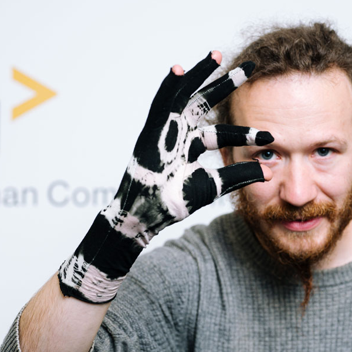
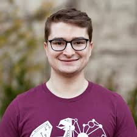
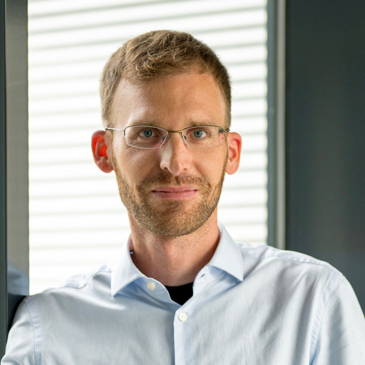

#### Paul Strohmeier [🔗](https://sensint.mpi-inf.mpg.de/index.html)

Leads the Sensorimotor Interaction group (senSInt) at the Max Planck Institute for Informatics (MPI-INF). His PhD work was honored with the SIGCHI Outstanding Dissertation Award. He has recently received an ERC Starting Grant for conducting research on kinesthetic perception, sensory augmentation, and on-body systems.

#### Laia Turmo Vidal [🔗](https://www.laiaturmovidal.com/)

Digital Futures Research Fellow at KTH Royal Institute of Technology, Sweden. Laia's work explores sensorimotor transformations facilitated by wearables and bio-responsive technologies, with the aim to create interactive experiences that are conducive to individual and collective care, health and wellbeing. Laia has facilitated body- and movement-centered design workshops at recent CHI, DIS, and IEEE World Haptics.

#### Gabriela Vega [🔗](https://scholar.google.com/citations?user=PriGV5kAAAAJ&hl=en)

Research assistant in the Sensorimotor Interaction Group at the MPI-INF, where her research focuses on developing wearables for Tactile AR and texture design. She is interested in human-computer interaction, haptics, AR, and tangibles for human augmentation and well-being.

#### Courtney N. Reed [🔗](https://www.courtneynreed.com/)

Musician, performer, and assistant professor in the Institute for Digital Technologies, Loughborough University London, London, United Kingdom. Her work explores the dynamics of agency and control between human and body through vocal performance. She designs biosignal-based wearables for augmented singing and is interested in first-person methodologies and micro-phenomenology.

#### Alex Mazursky [🔗](https://www.alexmazursky.com/)

PhD student in the Department of Computer Science at the University of Chicago, where he designs wearable devices that provide tactile feedback, transforming otherwise passive objects and surfaces into interactive experiences. He engineers haptic actuators from the ground up, integrating actuators into custom devices that create diverse sensations—such as vibration, friction, pressure, and temperature—to augment physical and virtual spaces.

#### Easa AliAbbasi [🔗](https://de.linkedin.com/in/easa-aliabbasi)

Postdoctoral researcher in the Sensorimotor Interaction Group at MPI-INF, where his research focuses on understanding human tactile perception and developing tactile displays to convey sensory information. During his PhD studies, he investigated the electro-mechanical interactions between human fingers and voltage-induced touchscreens under electroadhesion.

#### Ana Tajadura-Jiménez [🔗](https://imbodylab.com/)

Associate Professor in the DEI Interactive Systems Group at Universidad Carlos III de Madrid, and an Honorary Research Fellow at the University College London Interaction Center. She leads the i_mBODY lab, which focuses on interactive multisensory body-centered experiences at the intersection of HCI and neuroscience. She is the PI of the ERC-funded BODYinTRANSIT project, which explores the design of sensory technologies to alter body perceptions and promote positive changes in emotional and physical health in populations with body-related concerns.

#### Jürgen Steimle [🔗](https://scholar.google.de/citations?user=Cz_S3u8AAAAJ&hl=de)

Professor at Saarland University where he leads the Human-Computer Interaction Lab. Previously he was Senior Researcher at the MPI-INF and Visiting Assistant Professor at the MIT Media Lab. He holds a PhD in Computer Science from TU Darmstadt. Jürgen specializes in body-based interfaces that are soft and deformable, to offer novel opportunities for rich and expressive multi-sensory interaction. He is recipient of an ERC Starting Grant and his work on body-based interfaces has received Best Paper Awards at CHI and UIST. 

[back](../)
